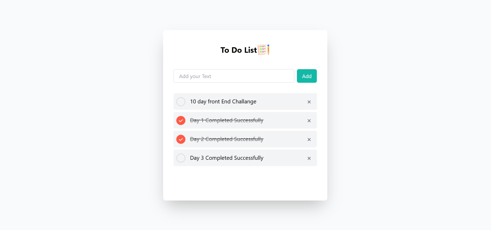

# 📝 To-Do List Web App

A clean and responsive To-Do List web application built using **HTML**, **Tailwind CSS**, and **JavaScript**. Users can add, check/uncheck, and remove tasks. The app persists tasks using **localStorage**, ensuring data is saved even after refreshing the page.

---

## 🚀 Features

- ✅ Add new tasks dynamically
- 📌 Check or uncheck tasks visually using checkbox icons
- ❌ Remove tasks with a simple click
- 💾 Data persistence using `localStorage`
- 💡 Responsive and user-friendly UI powered by Tailwind CSS

---

## 📂 Project Structure

```
📁 assests/
│   └── img/
│       ├── unchecked.png
│       └── checked.png
├── index.html
└── script.js
```

---

## 🛠️ Setup Instructions

1. **Clone the repository:**
   ```bash
   git clone https://github.com/your-username/todo-list-app.git
   cd todo-list-app
   ```

2. **Open `index.html` in your browser:**
   ```bash
   open index.html
   ```
   Or right-click the file and select **Open with Browser**.

3. **Ensure you have the required images:**
   - `assests/img/unchecked.png`
   - `assests/img/checked.png`

   These icons are used to represent task states.

---

## 📸 Preview

  
*Image is just for reference. Add a real screenshot if needed.*

---

## 📋 To-Do

- [ ] Add task editing functionality
- [ ] Drag-and-drop task reordering
- [ ] Mark all tasks complete
- [ ] Dark mode support

---

## 📄 License

This project is open-source and available under the [MIT License](LICENSE).

---

## 🙌 Acknowledgments

- Built with ❤️ using [Tailwind CSS](https://tailwindcss.com/)